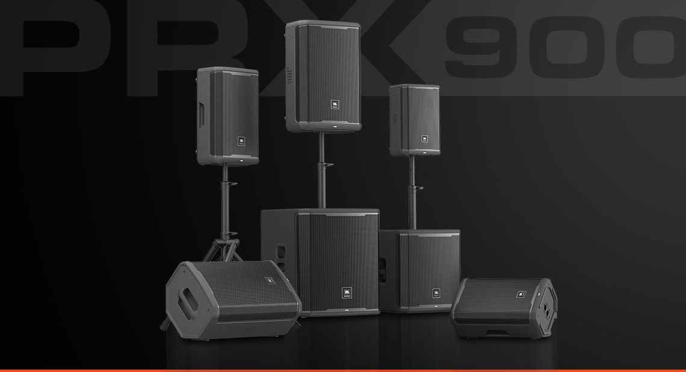
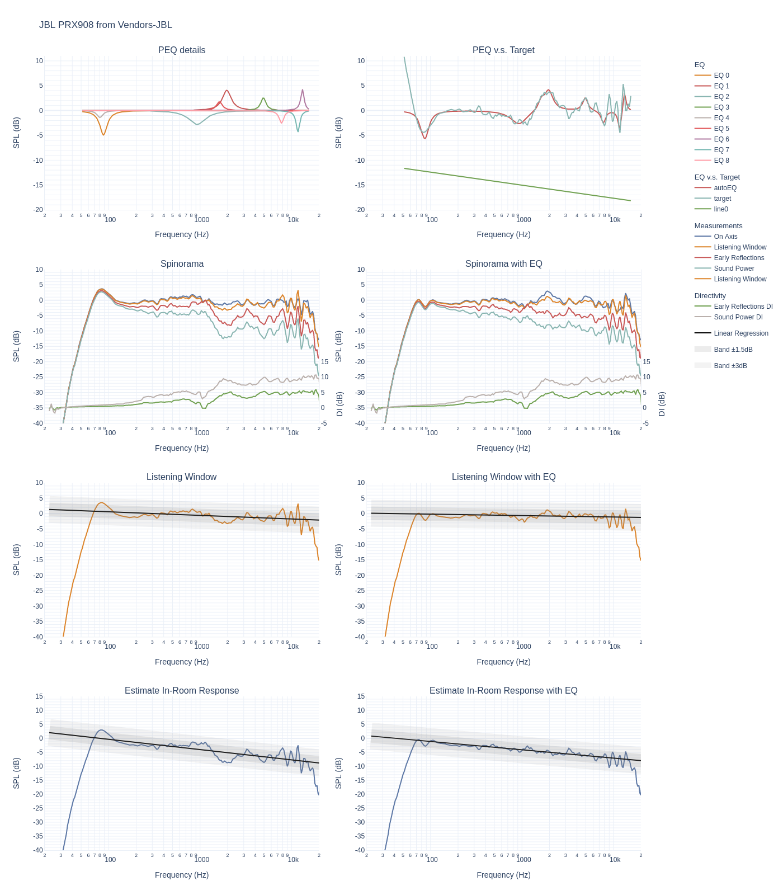
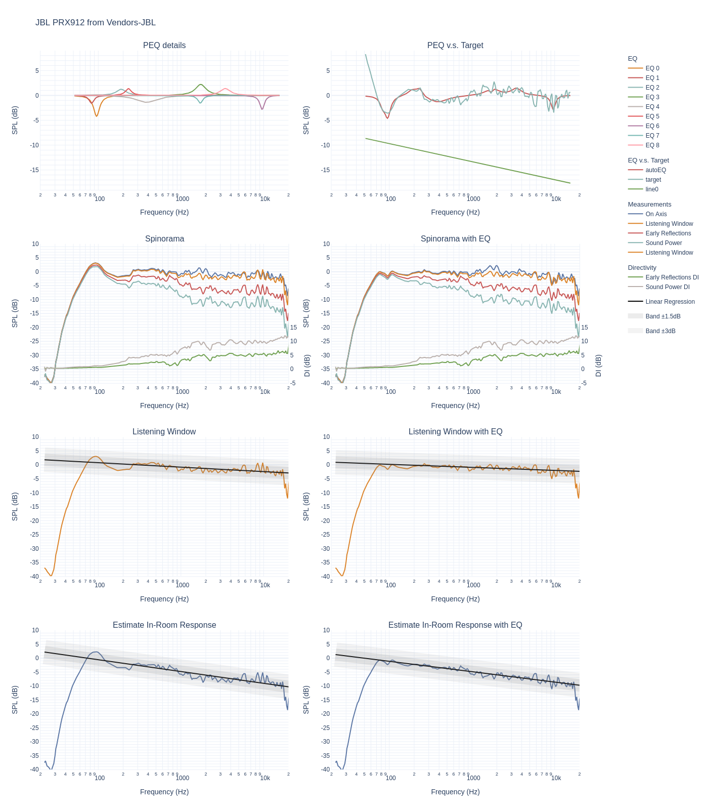
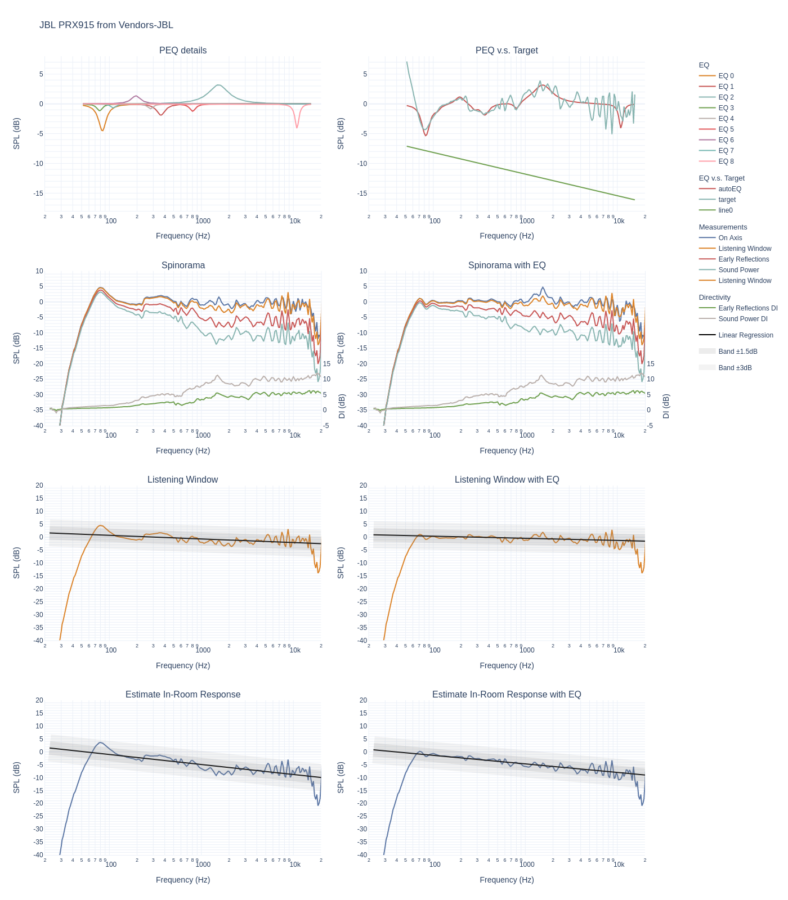
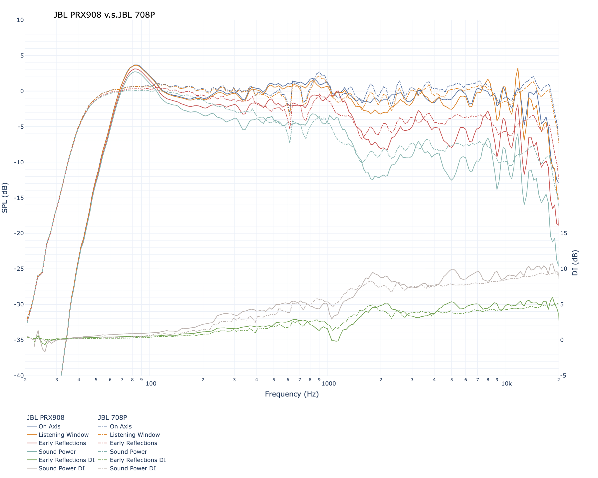

# This is a review of sort of the JBL PRX900 serie.

JBL PRX900 are PA speakers which are optimised for high output. They
are active, are relatively cheap, easy to get and have an internal
DSP. JBL is nice enough to provide a lot of datas for these speakers.

I used the data to generate the spinorama and derive some information.

Here is the marketing blurb from JBL:


   > JBL PRX900 Series powered loudspeakers and subwoofers take professional portable PA performance to a new level with advanced acoustics, comprehensive DSP, unrivaled power performance and durability and complete BLE control via the JBL Pro Connect ecosystem. The line, which includes three powered two-way loudspeakers and two powered subwoofers, has been entirely built from the ground up to leverage JBL’s most advanced acoustic innovations. Next-generation driver systems—powered by ultra-efficient 2,000-watt (peak) Class D amplifiers—deliver clarity and definition at maximum volume, with improved dispersion and smooth low-frequency extension. The PRX900 Series is a versatile solution for DJs and bands, music venues, rental houses, corporate A/V providers, or anyone who needs durable professional systems that deliver powerful, room-filling sound in any portable or installed scenario.



All 3 speakers have common properties:
- 1.5'' compression driver with a wave guide
- active speaker
- optimised for high SPL
- DSP included (similar to a dbx DriveRack)

The name of the speaker give you the size of the woofer PRX915 is a 15'' woofer.

Some data from JBL website:

| Model | Price (each) | -3dB | SPL Max| Pattern |
| --- | --- | --- | --- | --- |
| PRX908 |  900$ | 65Hz | 126dB | 105x60 |
| PRX912 | 1000$ | 65Hz | 132dB | 90x50 |
| PRX915 | 1100$ | 60Hz | 133dB | 90x50 |

## JBL PRX908

### Out of the box

Let's start with the standard graphs:

The directivity is not great (the green curve should be as linear as possible) but on axis and listening window are reasonably flat.

We have -3dB point at 62Hz. Frequency deviation is +/2.4dB. Tonality score is 3.5 and would be 6.1 with a perfect subwoofer.
If you add an EQ, the the score goes up to 4.4 and 7.0 with both EQ and subwoofer.


You can see that the speaker has been optimised to have a nice PIR (Predicted in room response):


We have a good horizontal pattern:


And we see the classical pinch of dipoles:


More graphs are [available](https://www.spinorama.org/speakers/JBL%20PRX908/JBL/index_vendor-pattern-105x60.html).

### With an EQ

Here is a potential EQ. Filter 4-9 are sharp and can be removed. They may marginally help.

```
EQ for JBL PRX908 computed from Vendors-JBL data
Preference Score 3.5 with EQ 4.5
Generated from http://github.com/pierreaubert/spinorama/generate_peqs.py v0.16
Dated: 2022-11-03-09:15:17

Preamp: -4.4 dB

Filter  1: ON PK Fc    87 Hz Gain -4.92 dB Q 4.40
Filter  2: ON PK Fc  1958 Hz Gain +4.08 dB Q 3.63
Filter  3: ON PK Fc   927 Hz Gain -2.80 dB Q 1.92
Filter  4: ON PK Fc  4923 Hz Gain +2.57 dB Q 5.88
Filter  5: ON PK Fc    80 Hz Gain -1.40 dB Q 5.70
Filter  6: ON PK Fc  1629 Hz Gain +1.77 dB Q 5.49
Filter  7: ON PK Fc 13172 Hz Gain +4.29 dB Q 5.70
Filter  8: ON PK Fc 11761 Hz Gain -4.34 dB Q 5.87
Filter  9: ON PK Fc  7760 Hz Gain -2.57 dB Q 5.93

```


And you see that's the PIR is significantly flater:


A visual comparison:


## JBL PRX912

### Out of the box

Let's start with the standard graphs:

The directivity is not great (the green curve should be as linear as possible) but on axis and listening window are reasonably flat.

We have -3dB point at 62Hz. Frequency deviation is +/3.2dB. Tonality score is 3.9 and would be 6.4 with a perfect subwoofer.
If you add an EQ, the the score goes up to 4.7 and 7.2 with both EQ and subwoofer.


You can see that the speaker has been optimised to have a nice PIR (Predicted in room response):


We have a good horizontal pattern:


And we see the classical pinch of dipoles:


More graphs are [available](https://www.spinorama.org/speakers/JBL%20PRX912/JBL/index_vendor-pattern-90x50.html).

### With an EQ

Here is a potential EQ. 

```
EQ for JBL PRX912 computed from Vendors-JBL data
Preference Score 3.9 with EQ 4.7
Generated from http://github.com/pierreaubert/spinorama/generate_peqs.py v0.16
Dated: 2022-11-03-09:21:27

Preamp: -1.6 dB

Filter  1: ON PK Fc    95 Hz Gain -4.21 dB Q 4.91
Filter  2: ON PK Fc    82 Hz Gain -1.57 dB Q 6.00
Filter  3: ON PK Fc   189 Hz Gain +1.24 dB Q 3.07
Filter  4: ON PK Fc  1737 Hz Gain +2.21 dB Q 2.74
Filter  5: ON PK Fc   383 Hz Gain -1.38 dB Q 1.40
Filter  6: ON PK Fc   231 Hz Gain +1.37 dB Q 4.95
Filter  7: ON PK Fc  9603 Hz Gain -2.83 dB Q 4.96
Filter  8: ON PK Fc  1713 Hz Gain -1.56 dB Q 5.98
Filter  9: ON PK Fc  3441 Hz Gain +1.38 dB Q 2.79

```


And you see that's the PIR is significantly flater:


A visual comparison:


## JBL PRX915

### Out of the box

Let's start with the standard graphs:

The directivity is better but on axis and listening window are less flat.

We have -3dB point at 62Hz. Frequency deviation is +/3.8dB. Tonality score is 2.9 and would be 5.2 with a perfect subwoofer.
If you add an EQ, the the score goes up to 3.6 and 6.0 with both EQ and subwoofer.

This one is significantly less good than the other two.


You can see that the speaker has been optimised to have a nice PIR (Predicted in room response).


We have a good horizontal pattern:


And we see the classical pinch of dipoles but also the speaker is significantly more directional.


More graphs are [available](https://www.spinorama.org/speakers/JBL%20PRX915/JBL/index_vendor-pattern-90x50.html).

### With an EQ

Here is a potential EQ. 

```
EQ for JBL PRX915 computed from Vendors-JBL data
Preference Score 2.9 with EQ 3.6
Generated from http://github.com/pierreaubert/spinorama/generate_peqs.py v0.16
Dated: 2022-11-03-09:22:25

Preamp: -3.3 dB

Filter  1: ON PK Fc    84 Hz Gain -4.55 dB Q 4.29
Filter  2: ON PK Fc   363 Hz Gain -1.89 dB Q 3.83
Filter  3: ON PK Fc  1539 Hz Gain +3.20 dB Q 1.62
Filter  4: ON PK Fc    78 Hz Gain -1.16 dB Q 5.63
Filter  5: ON PK Fc   279 Hz Gain -0.81 dB Q 5.60
Filter  6: ON PK Fc   803 Hz Gain -1.24 dB Q 5.43
Filter  7: ON PK Fc   193 Hz Gain +1.35 dB Q 3.61
Filter  8: ON PK Fc   110 Hz Gain -0.66 dB Q 5.86
Filter  9: ON PK Fc 10935 Hz Gain -4.11 dB Q 5.92

```


And you see that's the PIR is significantly flater:


A visual comparison:


## Comparison

### JBL PRX908 v.s. JBL 708P

The 708P is also an active 8'' but optimised for studio use. It's maximum output is 108dB continous and 114dB peak which is way lower
that the PRX908.

Look at the 2 spinoramas:

The DI curves are very similar but the studio version is smoother especially above 8kHz.

If you add some EQ to both, the difference almost vanishes:


# Conclusion

For PA speakers, the data shows very well executed speakers. I have not listen to this series (brand new) but the previous one was already not bad.