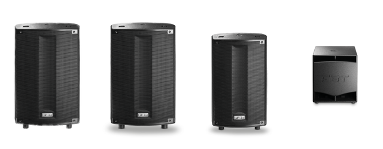
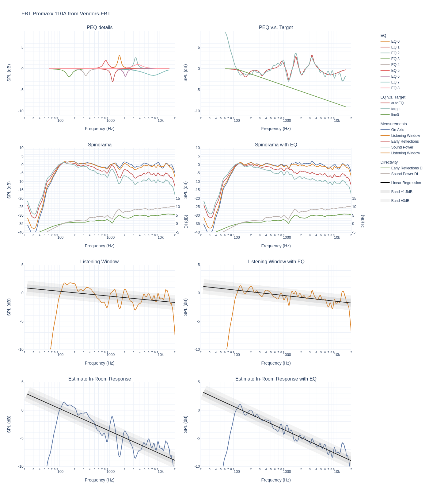
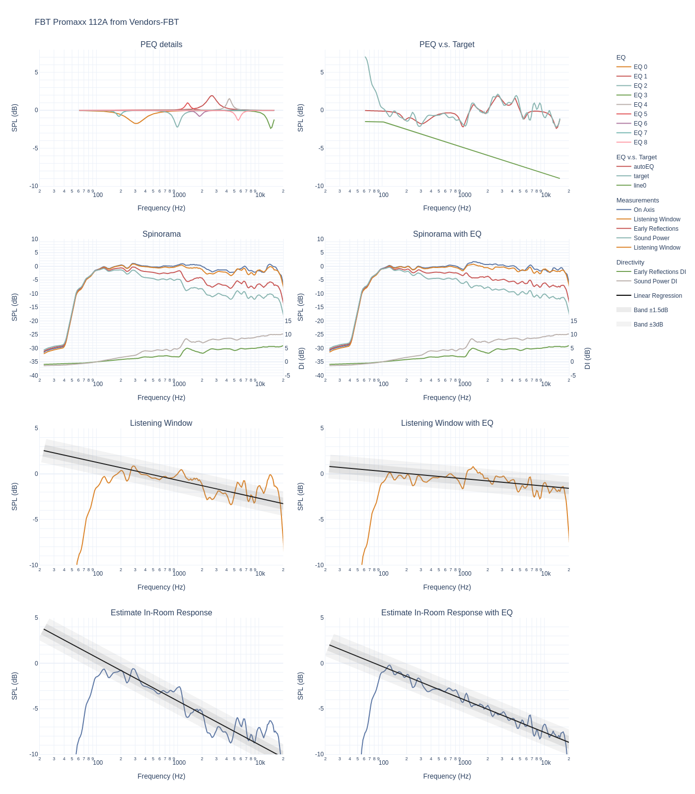
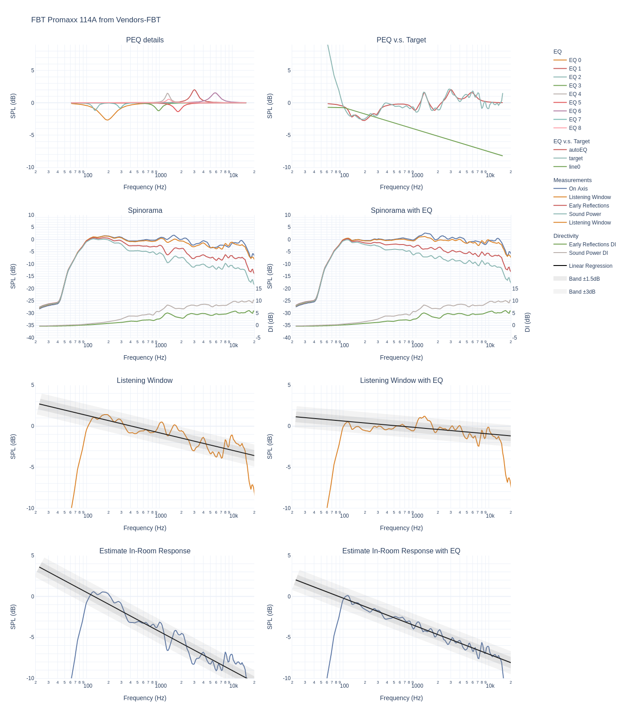

# Data analysis of FBT Promaxx serie

[FBT Promaxx](https://www.fbt.it/promaxx) are PA speakers which are optimised for high output. They are active, relatively cheap, easy to get and have an internal DSP. FBT is nice enough to provide a lot of datas for these speakers. Typical use cases are small gigs, your garage, your garden for a party, or HT duty. You need to add a subwoofer to get them full range. I decided to do the analysis because they are on the top of the list on Thomann. Are pro and semi-pro better at selecting speakers than audiophile? I used the data to generate the spinorama and derive some information.

Here is the marketing blurb from FBT:

   > With a specially developed polypropylene cabinet and stylish full grille aesthetic, the new PROMAXX by FBT represents the next step in the evolution of a portable sound classic. Equipped with custom FBT speakers complete with B&C’s renowned compression driver technology, PROMAXX combines true made-in-Italy quality and style. At its heart is a purpose-built FBT amplifier module with a switch-mode power supply. For the low frequency section, 700W RMS is driven via a highly efficient Class-D topology, boasting extremely low THD. For HF, meanwhile, 200W RMS is delivered by a Class-H / AB design chosen to ensure the highest definition of audio performance at high frequencies. Also onboard is a powerful digital signal processing (DSP) platform made available to users of all levels thanks to an intuitive graphical user interface. Located on the rear of the enclosure, the menu-driven system is navigated via a single rotary control with push-to-select functionality. Users can choose between 6 equalizer presets, each carefully designed by FBT engineers to ensure that every application is catered for (see below). Additionally, 2 preset slots are available for users to form their own designs, using 5 parametric equalizers per slot. Also available is a high-pass filter, a mic/line selector, low, mid and high tone settings and an optional delay of between 0 and 3.5 metres. Finally, users can exclusively choose between two limiter modes, MAX-SPL or MAX-QUALITY, to best suit their performance. The PROMAXX feature-set is matched by the enclosure’s versatility, with options for pole-mounting, wall-hanging, suspension or even deployment in an array. The result is the most accessible PROMAXX yet.



The 6 speakers in the serie have common properties:
- a horn that generates a 90 degrees horizontal and 60 degrees vertical dispersion pattern.
- 3 active and 3 passive speakers with a 10'', 12'' and 14'' each.
- optimised for high SPL (at least 105dB max over the frequency range and 120+dB peak SPL). You can listen to them at 3m to 10m without a problem.
- DSP is included 

The name of the speaker give you the size of the woofer FBT114A implies 14 inches and the A is for active.

Some data from FBT website and Thomann for prices and I let the JBL PRX900 serie data to be able to make comparison.

| Model | Price (each) | Low Freq | SPL Max| Pattern |
| --- | --- | --- | --- | --- |
| FBT Promaxx 110A |  607$ | 58Hz (-6dB) | 124dB | 90x60 |
| FBT Promaxx 112A |  752$ | 48Hz (-6dB) | 126dB | 90x60 |
| FBT Promaxx 114A |  966$ | 45Hz (-6dB) | 127dB | 90x60 |
| JBL PRX908 |  900$ | 58Hz (-6dB) | 126dB | 105x60 |
| JBL PRX912 | 1000$ | 54Hz (-6dB) | 132dB | 90x50 |
| JBL PRX915 | 1100$ | 51Hz (-6dB) | 133dB | 90x50 |

Note: the data provided by FBT is good but not great. They are smoother that what @Amir produces with his Klippel NFS. You can substract 0.5-0.7 to scores computed below.

## FBT Promaxx 110A

### Out of the box

Let's start with the standard spinorama or CEA2034 graph:

The directivity is not great between 1k and 2k where it matters a lot (the green curve should be as linear as possible) but on axis and listening window are reasonably flat and they will be eq-ed. The frequency response falls quickly below 90-100Hz which confirms that you need a subwoofer.

We have -3dB point at 88Hz. Frequency deviation is +/2.1dB. Many studio monitors are not doing as well. Tonality score is 3.5 and would be 6.3 with a perfect subwoofer. If you add an EQ (see below), the the score goes up to 4.9 and 7.7 with both EQ and subwoofer.

You can see that the speaker has been optimised to have a nice listening windon and on axis more than the predicted in room response:


We have a good horizontal pattern:


And we see the classical pinch of dipoles with a super narrow area around the crossover. Even if we are less sensitive to vertical issues than horizontal ones that's not ideal.


More graphs are [available](https://www.spinorama.org/speakers/FBT%20Promaxx%20110A/FBT/index_vendor-pattern-90x60.html)

### With an EQ

Here is a potential EQ optimising the PIR:

```
EQ for FBT Promaxx 110A computed from Vendors-FBT data
Preference Score 3.5 with EQ 4.9
Generated from http://github.com/pierreaubert/spinorama/generate_peqs.py v0.16
Dated: 2022-10-28-20:45:33

Preamp: -3.4 dB

Filter  1: ON PK Fc  1569 Hz Gain +3.21 dB Q 5.90
Filter  2: ON PK Fc  1149 Hz Gain -3.15 dB Q 5.93
Filter  3: ON PK Fc  3298 Hz Gain +2.83 dB Q 5.99
Filter  4: ON PK Fc   155 Hz Gain -1.94 dB Q 3.15
Filter  5: ON PK Fc   335 Hz Gain -1.64 dB Q 4.16
Filter  6: ON PK Fc   835 Hz Gain +2.03 dB Q 4.04
Filter  7: ON PK Fc  2062 Hz Gain -1.83 dB Q 5.51
Filter  8: ON PK Fc  7427 Hz Gain -1.59 dB Q 0.82
Filter  9: ON PK Fc  3642 Hz Gain +1.01 dB Q 1.80

```

And you see that's the PIR is significantly flater:


A visual side by side comparison:



## FBT Promaxx 112A

### Out of the box

Let's start with the standard graphs:

The directivity is not great between 1k and 2k where it matters a lot (the green curve should be as linear as possible) but on axis and listening window are reasonably flat and they will be eq-ed.

We have -3dB point at 82Hz. Frequency deviation is +/1.7dB which is very good. Tonality score is 4.9 and would be 7.7 with a perfect subwoofer.
If you add an EQ, the the score goes up to 5.5 and 8.3 with both EQ and subwoofer.

You can see that the speaker has been optimised to have a nice listening windon and on axis more than the predicted in room response:


We have a good horizontal pattern:


And we see the classical pinch of dipoles with a super narrow area around the crossover. Even if we are less sensitive to vertical issues than horizontal ones that's not ideal.


More graphs are [available](https://www.spinorama.org/speakers/FBT%20Promaxx%20112A/FBT/index_vendor-pattern-90x60.html)

### With an EQ

Here is a potential EQ optimising the PIR:

```
EQ for FBT Promaxx 112A computed from Vendors-FBT data
Preference Score 4.9 with EQ 5.5
Generated from http://github.com/pierreaubert/spinorama/generate_peqs.py v0.16
Dated: 2022-10-28-20:47:39

Preamp: -2.1 dB

Filter  1: ON PK Fc   308 Hz Gain -1.75 dB Q 1.62
Filter  2: ON PK Fc  2640 Hz Gain +1.94 dB Q 2.70
Filter  3: ON PK Fc   991 Hz Gain -2.23 dB Q 4.66
Filter  4: ON PK Fc 14128 Hz Gain -2.40 dB Q 2.55
Filter  5: ON PK Fc  4338 Hz Gain +1.54 dB Q 5.58
Filter  6: ON PK Fc  1328 Hz Gain +0.99 dB Q 5.94
Filter  7: ON PK Fc  1862 Hz Gain -0.79 dB Q 5.48
Filter  8: ON PK Fc   189 Hz Gain -0.81 dB Q 5.96
Filter  9: ON PK Fc  5586 Hz Gain -1.33 dB Q 5.57
```

And you see that's the PIR is significantly flater:


A visual side by side comparison:


## FBT Promaxx 114A

### Out of the box

Let's start with the standard graphs:

The directivity is not great between 1k and 2k where it matters a lot (the green curve should be as linear as possible) but on axis and listening window are reasonably flat and they will be eq-ed. It is better than the smaller speakers. On the other side, the listening window is slopping down a bit too much.

We have -3dB point at 82Hz. Frequency deviation is +/2.6dB. Tonality score is 4.6 and would be 7.5 with a perfect subwoofer.
If you add an EQ, the the score goes up to 5.4 and 8.3 with both EQ and subwoofer. 

You can see that the speaker has been optimised to have a nice predicted in room response more than a good listening window and on axis.

Staying between +/- 1.5dB over 100Hz to 15kHz is excellent.


We have a good horizontal pattern:


And we see the classical pinch of dipoles with a super narrow area around the crossover. Even if we are less sensitive to vertical issues than horizontal ones that's not ideal.


More graphs are [available](https://www.spinorama.org/speakers/FBT%20Promaxx%20114A/FBT/index_vendor-pattern-90x60.html)

### With an EQ

Here is a potential EQ optimising the PIR:

```
EQ for FBT Promaxx 114A computed from Vendors-FBT data
Preference Score 4.6 with EQ 5.4
Generated from http://github.com/pierreaubert/spinorama/generate_peqs.py v0.16
Dated: 2022-10-28-20:48:14

Preamp: -2.2 dB

Filter  1: ON PK Fc   193 Hz Gain -2.67 dB Q 1.64
Filter  2: ON PK Fc  3014 Hz Gain +2.03 dB Q 3.62
Filter  3: ON PK Fc   130 Hz Gain -1.20 dB Q 5.94
Filter  4: ON PK Fc   972 Hz Gain -1.24 dB Q 3.95
Filter  5: ON PK Fc  1293 Hz Gain +1.49 dB Q 5.92
Filter  6: ON PK Fc  1794 Hz Gain -1.38 dB Q 3.49
Filter  7: ON PK Fc  5806 Hz Gain +1.54 dB Q 2.63
Filter  8: ON PK Fc   289 Hz Gain -0.86 dB Q 5.93
Filter  9: ON PK Fc  1342 Hz Gain +0.56 dB Q 5.56

```

And you see that's the PIR is significantly flater:


A visual side by side comparison:


# Conclusion

These PA speakers have a reasonable price with amplifiers and DSP included. The data shows well executed speakers but not outstanding. I have listen to these a few times but not in a place where I could tell if they are very good or not. They are definitvely designed to be used with a subwoofer and integration with a DSP in required. They are still better than a fair amount of "Hifi" speakers and you are not limited in term of output. If you have a large home theater, a large garage, a barn or just want to party outside in the garden, you will get good sound. You will need to pay a lot more to get a significant improvement in quality. That may explain why they are a bestseller at Thomann. They do not show up at Sweetwater, maybe they are not looking at the US market or there is too much competition there. If you are in Europe, I would give them a listen.