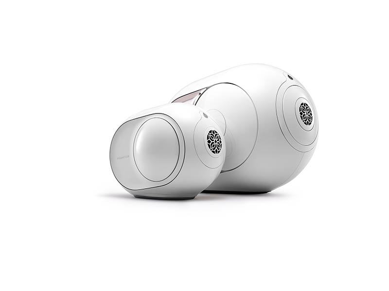
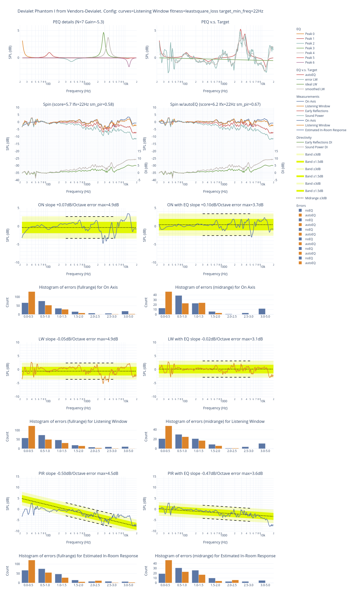
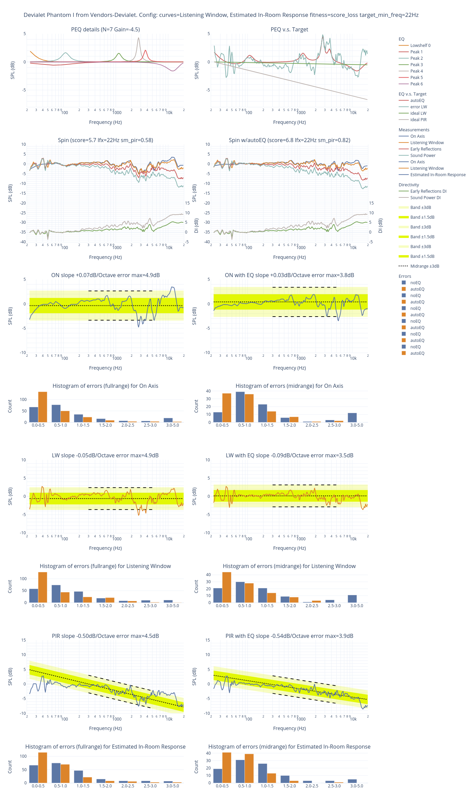
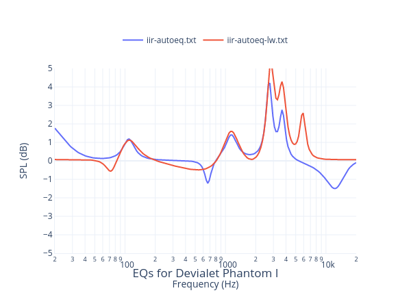
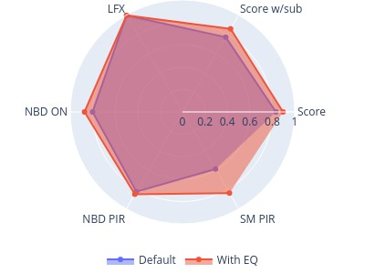
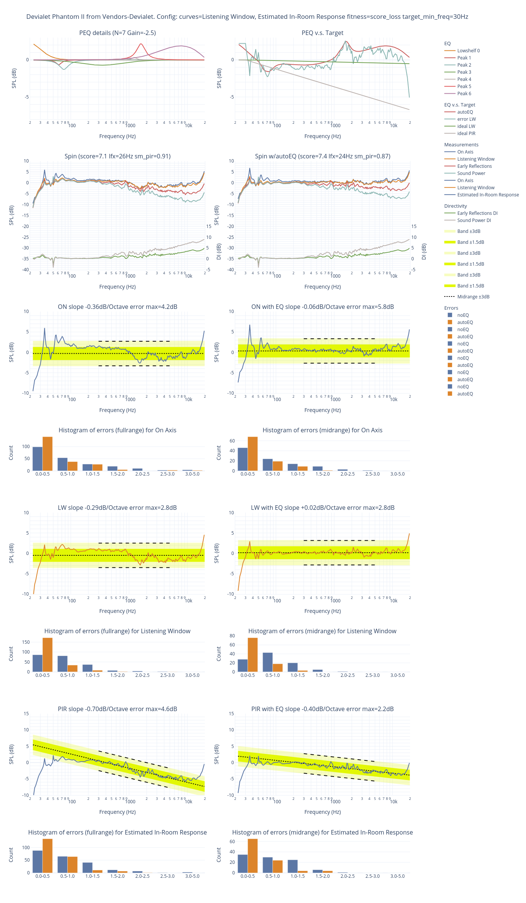
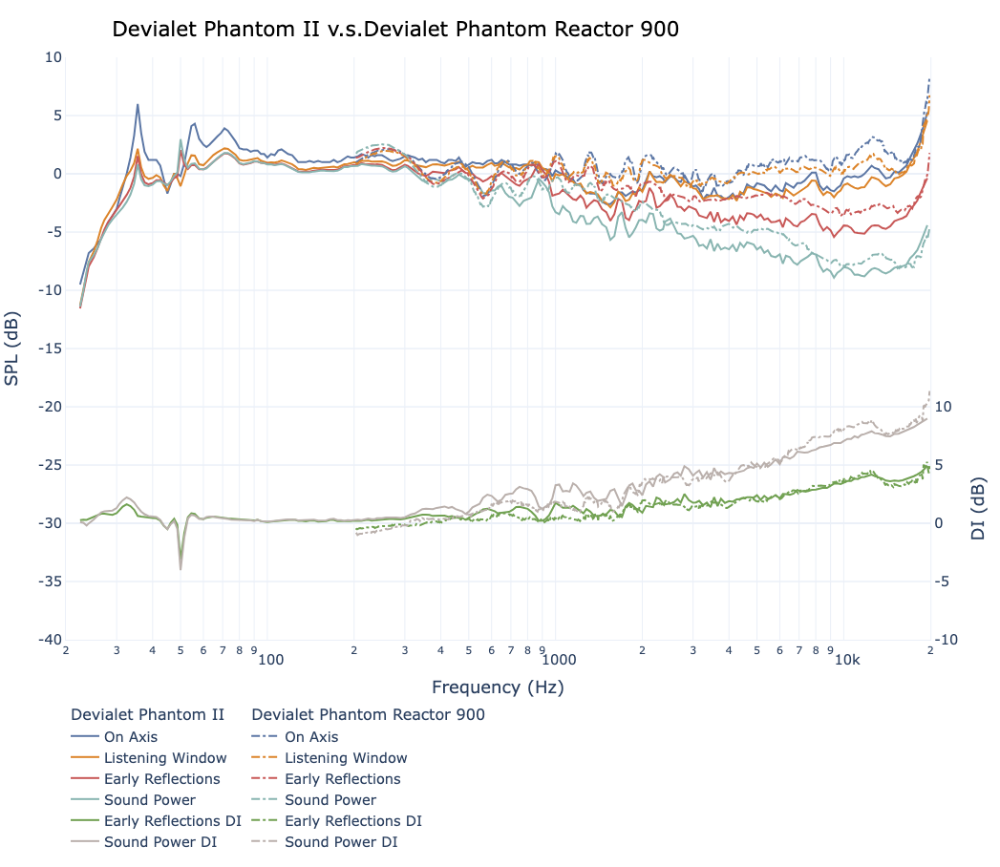
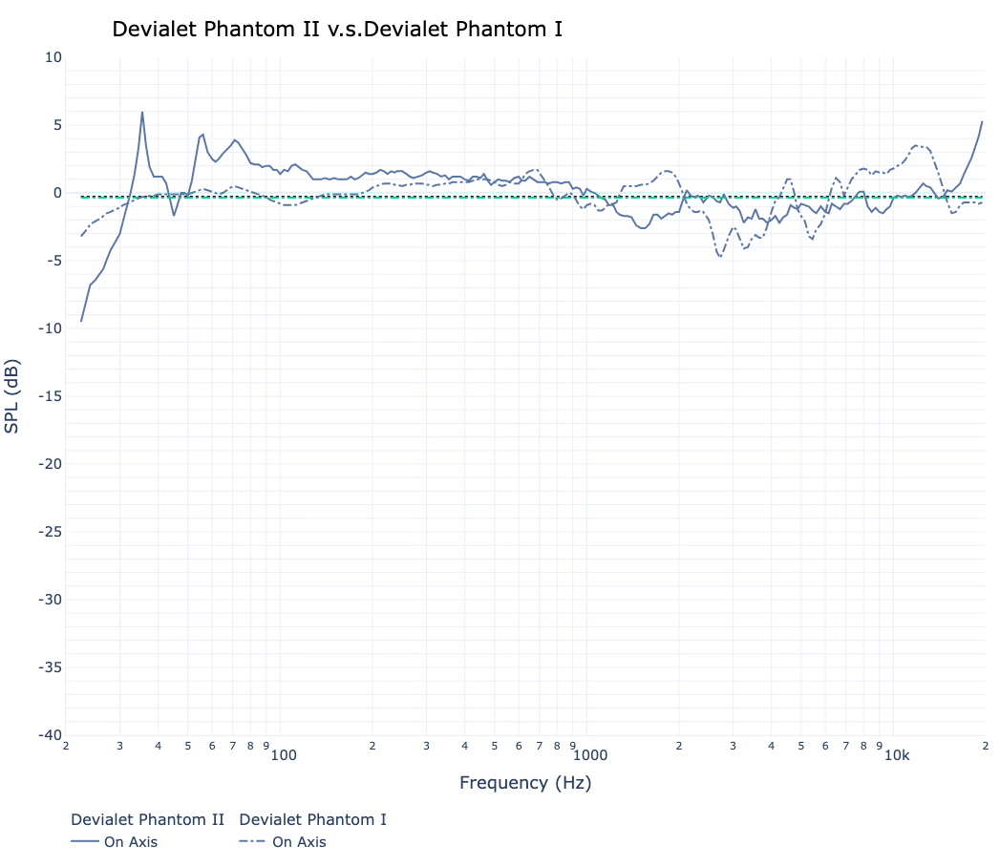

# Analysis of the Devialet Phantom I & II measurements

The Devialet Phantom are smallish speakers with excellent bass. 
They are expensive but looks nice and I always liked the sound of
them. 

I ordered a pair a few years ago (the large model in 2017): the sound
was great but I was struggling too much with the sofware parts and the
box that is supposed to help to link a pair. The box often
disconnected the speakers, the sofware was buggy. I hope they have fixed it. 

Latency was relatively high by default but they had a way to put it 
way down.

At the end I returned them.

Recently I noticed that Devialet released a set of [measurements](https://www.afmg-support.eu/AFMGDownloads/Downloads.aspx?SWP=EASE5&FILE=Devialet.zip) for
both speakers and wanted to look at them and compare with quasi
anechoic [measurements](https://www.audiosciencereview.com/forum/index.php?threads/devialet-phantom-reactor-900-measurements-now-with-spinorama.9963/page-2#post-305596) done by [napilopez](https://www.audiosciencereview.com/forum/index.php?members/napilopez.3902/).

I used the data to generate the spinorama and derive some information.

Here is the marketing blurb from Devialet for the Phantom I:


   > Phantom I 103 dB, the ultimate connected speaker with its
   > Remote. Hear every detail brought to life with unthinkable
   > clarity and precision by a Grade I Titanium tweeter. Surrender to
   > indecent power and ultra-deep bass. Sound in its purest and most
   > essential form. No apologies.
   
and for the Phantom II:


   > Ultra compact.
   >   By stretching size and performance beyond reasonable limits,
   >   Devialet engineers have brought to life Phantom II: the only
   >   ultra-compact home sound system capable of delivering high
   >   fidelity and physical impact, whatever the volume.
   > 
   > One implosive sound.
   >   Unreasonably compact for a system this powerful, Phantom II
   >   fits in almost anywhere. Made for compulsive listening
   >   experiences, the easy-to-transport Phantom features every
   >   available Devialet technology in under 3 liters. 
   
They definitively have great marketing, let's see if the measurements
back it off.

Phantom I is the big brother:


## Phantom I

### Performance

Harmann/ Olive scores:

| Speaker |  Score | w/sub |
| Phantom I (reference) | *5.7* | 6.3 |
| Phantom I (eq lw)   | *6.2* | 7.0 |
| Phantom I (eq score)| *6.8* | 7.6 |

This is good and at least part of the marketing is correct. For the
maximum output, it is sold for 103dB (this model, they have more
powerful one) but they do not tell at which frequency and if that's
peak or continuous. The data from the GLL file are not helping to
answer this.

### Out of the box

Let's start with the standard graph:


Things are awesome below 2kHz with a flat response and an incredible 22Hz for -3dB point. Then we have a directivity error AND a significant drop (3dB) on all curves that should be audible.


Looking at the dispersion, the normalized horizontals shows the same
thing: excellent below 1kHz, great below 4k and then messy.

We have a good horizontal and vertical patterns, the round head and the coaxial design are going good:


The horizontal and vertical contours shows the beaming and the
weakness where the directivity changes:


Due to the beaming you will need to have your listening position in a &pm;35&deg; cone in order to have smooth treble.

More graphs are [available](https://www.spinorama.org/speakers/Devialet%20Phantom%20I/Devialet/index_vendor.html) on [spinorama.org](https://www.spinorama.org).

### With an EQ

### Let's flatten the listening window first.

As expected the first eq linearize the listening window which is post
EQ in the &pm;3dB band. A possibly unwelcome is that now
the PIR does not go down enough and the speaker may be bright.

The histograms show nice improvements on all curves.
Note that for each curve, we have two histograms: one is full range and the other focus on the midrange. To understand if the EQ is having a positive impact, look at the EQ (orange) bars, they must be higher than the blue (reference) ones.


The following EQ will cost you 5dB of headroom:
```
EQ for Devialet Phantom I computed from Vendors-Devialet data
Preference Score 5.72 with EQ 6.18
Generated from http://github.com/pierreaubert/spinorama/generate_peqs.py v0.24
Dated: 2023-09-10-13:30:29

Preamp: -5.5 dB

Filter  1: ON PK Fc    22 Hz Gain +3.28 dB Q 5.22
Filter  2: ON PK Fc    76 Hz Gain -0.68 dB Q 2.43
Filter  3: ON PK Fc   109 Hz Gain +1.29 dB Q 2.02
Filter  4: ON PK Fc   447 Hz Gain -0.52 dB Q 0.57
Filter  5: ON PK Fc  1103 Hz Gain +1.54 dB Q 3.17
Filter  6: ON PK Fc  2813 Hz Gain +4.91 dB Q 5.01
Filter  7: ON PK Fc  3676 Hz Gain +3.76 dB Q 4.22
```

### Let's flatten the predicted in-room response / score:



```
EQ for Devialet Phantom I computed from Vendors-Devialet data
Preference Score 5.72 with EQ 6.78
Generated from http://github.com/pierreaubert/spinorama/generate_peqs.py v0.24
Dated: 2023-09-10-13:36:59

Preamp: -4.5 dB

Filter  1: ON LS Fc    22 Hz Gain +4.16 dB Q 0.52
Filter  2: ON PK Fc    68 Hz Gain -0.57 dB Q 0.47
Filter  3: ON PK Fc   109 Hz Gain +1.64 dB Q 2.31
Filter  4: ON PK Fc  1141 Hz Gain +1.53 dB Q 3.21
Filter  5: ON PK Fc  2721 Hz Gain +4.33 dB Q 5.90
Filter  6: ON PK Fc  3676 Hz Gain +2.09 dB Q 4.87
Filter  7: ON PK Fc 12246 Hz Gain -1.62 dB Q 0.95
```

### EQ's side by side

The 2 EQs are marginally different: they are trying to flatten the LW. Since the speaker is beaming a lot above 8kHz, the optimizer tries to compensate and give away some flatness on the LW to optimize for a flat PIR.



This EQ is able to optimise the score significantly:



## Phantom II

Let's now have a look at the smaller one.

### Performance

Harmann/ Olive scores:

| Speaker |  Score | w/sub |
| Phantom II (reference) | **7.0** | 8.1 |
| Phantom II (eq)   | **7.3** | 8.3 |

This is excellent! For the maximum output, it is sold for 95dB (this model, they have more
powerful one) but they do not tell at which frequency and if that's
peak or continuous. The data from the GLL file are not helping to
answer this. That's not a lot and it means they are perfect for near field listening or maybe mid-field aka 1 meter to 2.5 meter.

### Out of the box

Let's start with the standard graph:


Things are awesome below 1kHz with a flat response and then they is a small (2dB) deep that should be audible. Top end is bright. The On Axis is very good, good enough to be 
a studio monitor with some light corrections.


Looking at the dispersion, the normalized horizontals shows the same
thing: excellent below 1kHz, great below 4k and then messy.

We have a good horizontal and vertical patterns, the round head and the coaxial design are going good:


The horizontal and vertical contours shows the beaming and the
weakness where the directivity changes:


If you look closely at the contrours, it is possible that the measurements are swapped out. 

Due to the beaming you will need to have your listening position in a &pm;35&deg; cone in order to have smooth treble.

More graphs are [available](https://www.spinorama.org/speakers/Devialet%20Phantom%20II/Devialet/index_vendor.html) on [spinorama.org](https://www.spinorama.org).

### With an EQ

Since the Listening Window is already very good, let's focus on the Predicted In-Room Response:

### Let's flatten the predicted in-room response / score:

Now that's awesome:


```
EQ for Devialet Phantom II computed from Vendors-Devialet data
Preference Score 7.06 with EQ 7.35
Generated from http://github.com/pierreaubert/spinorama/generate_peqs.py v0.24
Dated: 2023-09-10-14:03:17

Preamp: -2.5 dB
  
Filter  1: ON LS Fc    30 Hz Gain +2.87 dB Q 0.90
Filter  2: ON PK Fc    62 Hz Gain -0.66 dB Q 3.73
Filter  3: ON PK Fc    76 Hz Gain -1.28 dB Q 2.17
Filter  4: ON PK Fc   342 Hz Gain -0.71 dB Q 0.41
Filter  5: ON PK Fc  1220 Hz Gain +0.32 dB Q 4.56
Filter  6: ON PK Fc  1594 Hz Gain +2.18 dB Q 2.37
Filter  7: ON PK Fc  7669 Hz Gain +1.88 dB Q 0.37
```

### Comparison with quasi anechoid measurement

As oftern very good concordance between the two:


## Comparison between Phantom I and Phantom II

Phantom II is significantly flatter than the I. They both relative minor issues in the 1kHz to 6kHz range. It is likely audible on the I and difficult to hear on the II.


## Conclusion

Harmann/ Olive scores:

| Speaker |  Score | w/sub |
| Phantom I (reference) | **5.7** | 6.5 |
| Phantom I (eq lw)   | **6.2** | 7.0 |
| Phantom I (eq score)| **6.8** | 7.6 |
| Phantom II (reference) | **7.0** | 8.1 |
| Phantom II (eq)   | **7.3** | 8.3 |

Max output is around 104dB for Phantom I and 95dB for Phantom II.

The Phantoms are good speakers both objectively and subjectively with
some deficiencies. The Phantom I will impress you with its output and
bass but you may complain about the top end. I would use a DSP to tame
it.

The Phantom II looks excellent without EQ and awesome with it. That's
the same level of quality as a
[KEF
R5](https://www.spinorama.org/speakers/KEF%20R5%20Meta/KEF/index_vendor-v2.html)
to give an idea. It is limited in terms of output but it would be
perfect on a desk. It can compete with 
[Genelec 8341](https://www.spinorama.org/speakers/Genelec%208341A/ASR/index_asr-vertical.html),
[Neumann KH150](https://www.spinorama.org/speakers/Neumann%20KH%20150/ASR/index_asr.html)
or look alike. Price is not cheap but the look is very different and
may be easier to integrate in modern design houses. 


