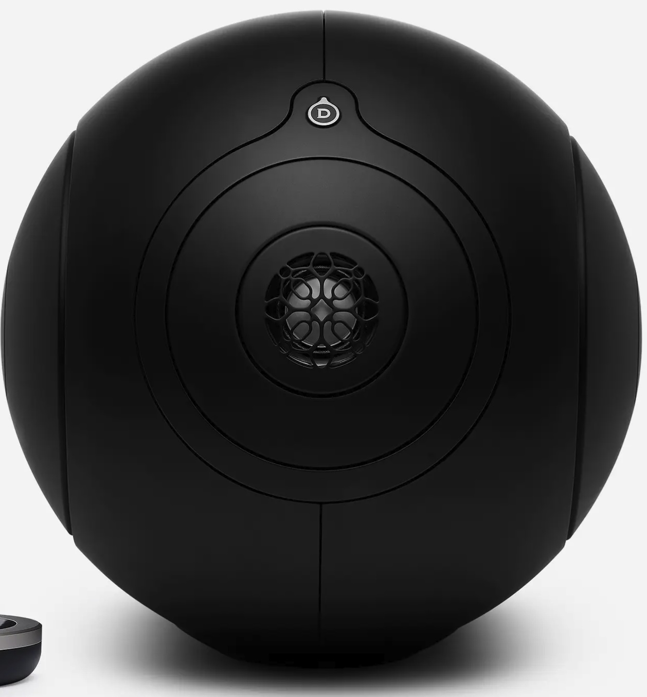
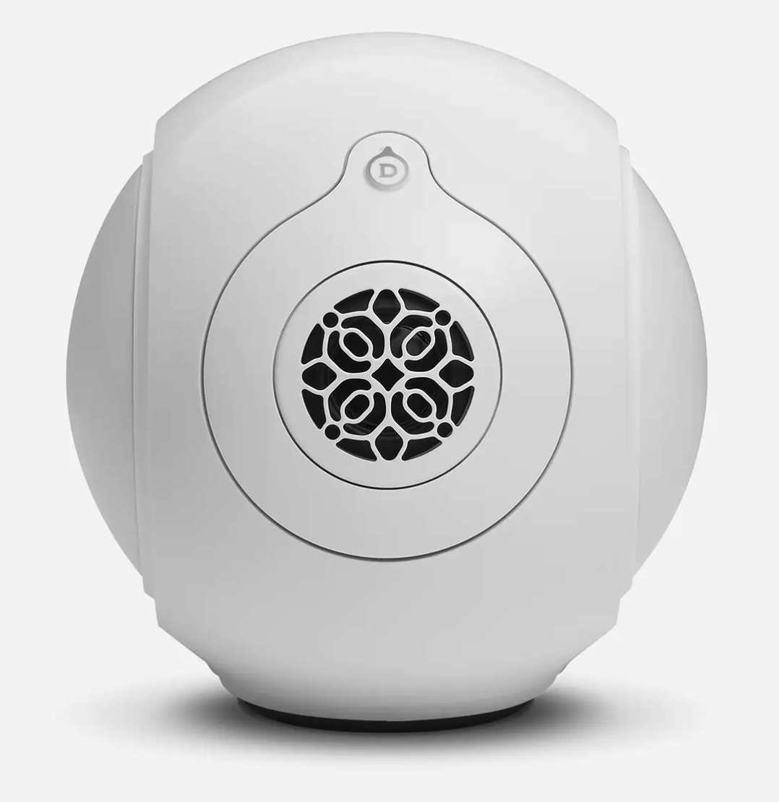

# This is a analysis of the Devialet Phantom I & II measurements

The Devialet Phantom are smallish speakers with excellent bass. 
They are expensive but looks nice and I always liked the sound of
them. 

I ordered a pair a few years ago (the large model in 2017): the sound
was great but I was struggling too much with the sofware parts and the
box that is supposed to help to link a pair. The box often
disconnected the speakers, the sofware was buggy. I hope they have fixed it. 

Latency was relatively high by default but they had a way to put it 
way down.

At the end I returned them.

Recently I noticed that Devialet released a set of measurements for
both speakers and wanted to look at them and compare with quasi
anechoic [measurements](https://www.audiosciencereview.com/forum/index.php?threads/devialet-phantom-reactor-900-measurements-now-with-spinorama.9963/page-2#post-305596) done by [napilopez](https://www.audiosciencereview.com/forum/index.php?members/napilopez.3902/).

I used the data to generate the spinorama and derive some information.

Here is the marketing blurb from Devialet for the Phantom I:


   > Phantom I 103 dB, the ultimate connected speaker with its
   > Remote. Hear every detail brought to life with unthinkable
   > clarity and precision by a Grade I Titanium tweeter. Surrender to
   > indecent power and ultra-deep bass. Sound in its purest and most
   > essential form. No apologies.
   
and for the Phantom II:


   > Ultra compact.
   >   By stretching size and performance beyond reasonable limits,
   >   Devialet engineers have brought to life Phantom II: the only
   >   ultra-compact home sound system capable of delivering high
   >   fidelity and physical impact, whatever the volume.
   > 
   > One implosive sound.
   >   Unreasonably compact for a system this powerful, Phantom II
   >   fits in almost anywhere. Made for compulsive listening
   >   experiences, the easy-to-transport Phantom features every
   >   available Devialet technology in under 3 liters. 
   
They definitively have great marketing, let's see if the measurements
back it off.





## Phantom I

### Performance

Harmann/ Olive scores:

| Speaker |  Score | w/sub |
| Phantom 1 reference | *5.7* | 6.3 |
| Phantom 1 (eq lw)   | *6.2* | 7.0 |
| Phantom 1 (eq score)| *6.8* | 7.6 |

This is good and at least part of the marketing is correct. For the
maximum output, it is sold for 103dB (this model, they have more
powerful one) but they do not tell at which frequency and if that's
peak or continuous. The data from the GLL file are not helping to
answer this.

### Out of the box

Let's start with the standard graphs:

Things are awesome below 2k Hz with a flat response and an incredible
22Hz for -3dB point. Then we have a directivity error AND a a
significant drop (3dB) on all curves that should be audible.

Looking at the dispersion, the normalized horizontals shows the same
thing: excellent below 1kHz, great below 4k and then messy.

We have a good horizontal and vertical patterns:


The horizontal and vertical contours shows the beaming and the
weakness where the directivity changes:


Due to the beaming you will need to have your listening position in a +/- 35 deg cone in order to have smooth treble.

More graphs are [available](https://www.spinorama.org/speakers/Devialet%20Phantom%20I/Devialet/index_vendor.html)

### With an EQ

### Let's flatten the listening window first.

As expected the first eq linearize the listening window which is post
EQ in the -3+3dB band. A consequence possible unwelcome is that now
the PIR does not go down enough and the speaker may be brighter.
The histograms show nice improvements on all curves.


```
EQ for Devialet Phantom I computed from Vendors-Devialet data
Preference Score 5.72 with EQ 6.18
Generated from http://github.com/pierreaubert/spinorama/generate_peqs.py v0.24
Dated: 2023-09-10-13:30:29

Preamp: -5.5 dB

Filter  1: ON PK Fc    22 Hz Gain +3.28 dB Q 5.22
Filter  2: ON PK Fc    76 Hz Gain -0.68 dB Q 2.43
Filter  3: ON PK Fc   109 Hz Gain +1.29 dB Q 2.02
Filter  4: ON PK Fc   447 Hz Gain -0.52 dB Q 0.57
Filter  5: ON PK Fc  1103 Hz Gain +1.54 dB Q 3.17
Filter  6: ON PK Fc  2813 Hz Gain +4.91 dB Q 5.01
Filter  7: ON PK Fc  3676 Hz Gain +3.76 dB Q 4.22
```

### Let's flatten the predicted in-room response / score:


```
EQ for Devialet Phantom I computed from Vendors-Devialet data
Preference Score 5.72 with EQ 6.78
Generated from http://github.com/pierreaubert/spinorama/generate_peqs.py v0.24
Dated: 2023-09-10-13:36:59

Preamp: -4.5 dB

Filter  1: ON LS Fc    22 Hz Gain +4.16 dB Q 0.52
Filter  2: ON PK Fc    68 Hz Gain -0.57 dB Q 0.47
Filter  3: ON PK Fc   109 Hz Gain +1.64 dB Q 2.31
Filter  4: ON PK Fc  1141 Hz Gain +1.53 dB Q 3.21
Filter  5: ON PK Fc  2721 Hz Gain +4.33 dB Q 5.90
Filter  6: ON PK Fc  3676 Hz Gain +2.09 dB Q 4.87
Filter  7: ON PK Fc 12246 Hz Gain -1.62 dB Q 0.95
```

### EQ's side by side

The 2 eqs are marginally different:


and optimise the score significantly:


## Conclusion

The Phantom is a good speaker both objectively and subjectively with
some deficiencies. I would recommend using a DSP with it.


